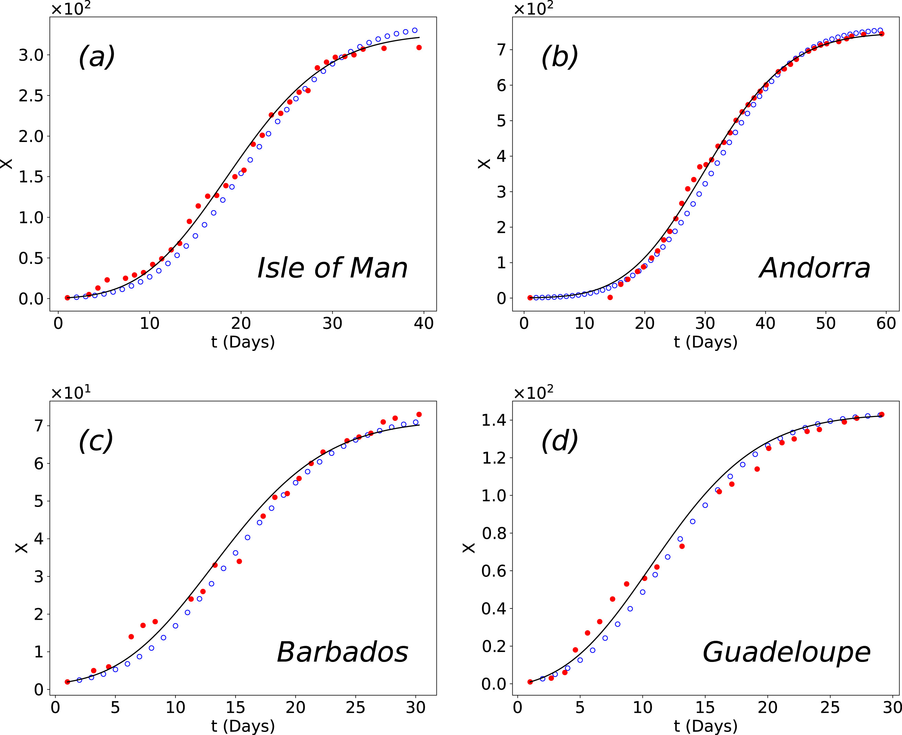

# Numerical, Monte Carlo

This project compares numerical solutions, stochastic Monte Carlo simulations and real data utilizing SIRX (Susceptible, Infected, Recovered, X: Quarantined) model, which introduces the state X. The model is implemented in:

https://www.science.org/doi/full/10.1126/science.abb4557

## The model 

The typical compartmental SIR model explains procedures like infection (with rate alpha) and recovery(with rate beta). However, it is also important to consider how lockdown measures would affect the dynamics of the system. In SIRX, behavioural changes, like wearing masks and hand washing will slow down the spread of the infection in the case of COVID-19. It is assumed that due to these changes and individuals will be removed from the transmission process with a rate kappa. Moreover a lot of infected individuals will be considered symptomatic (X) (with rate kappa0) and will be quarantined.

## Our work

We expand Brockmann's work, by applying the model in more countries/provinces than in the original paper. We find the parameters kappa and kappa0 that best fit the real data of confirmed cases by solving numerically the differential equations of the model with RK4, using a part of Brockmann's code. Then we use the values of the parameters to create stochastic Monte Carlo simulations in different theoretical network models, and compare them with the ODEs and the real data.

<figure>
  
  <figcaption> Number of quarantined, X, individuals over time. Comparison between simulation (blue dots), best numerical fit(black lines) and real data (red dots) for different countries</figcaption>
</figure>

The real data of the confirmed cases used in this project, are located in

https://www.thelancet.com/journals/laninf/article/PIIS1473-3099(20)30120-1/fulltext

If you use this code or find the models relevant to your research, please cite our work https://www.mdpi.com/1099-4300/24/8/1069 where we present our results in detail.
